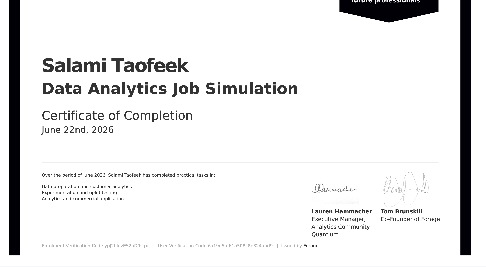

# Quantium Data Analytics Virtual Experience
### Forage Job Simulation | June 2026

This repository contains my completed work for the **Quantium Data Analytics Job Simulation** on Forage — a practical, real-world analytics engagement centred on chip category purchasing behaviour and retail trial store performance.

---

## Certificate of Completion

[](https://www.theforage.com/completion-certificates/32A6DqtsbF7LbKdcq/NkaC7knWtjSbi6aYv_32A6DqtsbF7LbKdcq_6a19e5bf61a508c8e824abd9_1782130518123_completion_certificate.pdf)

**Credential ID:** ypJ2bkfzES2oD9sgx  
**Issued by:** Forage | June 22, 2026  
**Verify:** [View Certificate](https://www.theforage.com/completion-certificates/32A6DqtsbF7LbKdcq/NkaC7knWtjSbi6aYv_32A6DqtsbF7LbKdcq_6a19e5bf61a508c8e824abd9_1782130518123_completion_certificate.pdf)

---

## Project Overview

As part of Quantium's retail analytics team, I was tasked with analysing chip purchasing behaviour and evaluating trial store performance to provide strategic recommendations to a Category Manager (Julia) for the upcoming half-year strategic plan.

**Data scope:** 264,836 raw transactions across 264 stores, July 2018 – June 2019, covering 72,637 loyalty customers.

---

## Tasks Completed

### Task 1 — Data Preparation & Customer Analytics
**Notebook:** `notebooks/task1_data_prep.ipynb`

- Loaded and cleaned two datasets: transaction data (264,836 rows) and customer purchase behaviour (72,637 rows)
- Fixed Excel serial date format, cleaned product name spacing, removed a bulk buyer outlier (200-unit purchases), and removed 19,532 non-chip product rows (salsa dips)
- Engineered two new features: `PACK_SIZE` and `BRAND`, extracted from product names using regex
- Standardised 20 brand names (e.g. `RRD` → `Red Rock Deli`, `GrnWves` → `Grain Waves`)
- Merged transaction and customer data on loyalty card number with zero data loss (245,302 rows, 12 columns)
- Defined a 10-KPI framework and analysed sales and customer counts by lifestage and spending tier

**Key findings:**
- Total chip sales: $1.80M across 71,185 unique customers
- Families (Older and Young) are the highest-value customers per head, spending $32–$35 on average with 4.4–4.7 transactions per customer
- Young Singles/Couples Mainstream drive the highest total sales ($147K) through volume alone — 7,908 customers spending just $18.62 each on average
- Kettle is the dominant brand across all major segments; 175g is the most purchased pack size

---

### Task 2 — Experimentation & Uplift Testing
**Notebook:** `notebooks/task2_trial_vs_control.ipynb`

- Aggregated transaction data to store-month level (3,165 records across 264 stores)
- Built a composite similarity scoring function using Pearson correlation and normalised magnitude distance across two metrics (total sales and number of customers) to identify control stores for trial stores 77, 86, and 88
- Selected control stores: 233 (score: 0.97), 155 (score: 0.91), and 237 (score: 0.77)
- Visualised pre-trial trends for all three pairs to validate matches
- Applied pre-trial scaling factors to control store data to account for baseline size differences
- Plotted 5th and 95th percentile confidence bands derived from pre-trial standard deviation to assess statistical significance of trial period uplift

**Results:**

| Trial Store | Control Store | Sales Uplift | Customer Uplift | Significant Months |
|-------------|--------------|-------------|----------------|-------------------|
| 77 | 233 | +33.5% | +29.1% | 2/3 (sales & customers) |
| 86 | 155 | +8.5% | +12.7% | 1/3 sales, 2/3 customers |
| 88 | 237 | +13.2% | +6.6% | 1/3 (sales & customers) |

**Conclusion:** Store 77 provides the strongest and most reliable evidence of a positive trial effect. All three trial stores outperformed their control stores during the trial period. Store 88 results should be interpreted with caution due to the weaker pre-trial control match.

---

### Task 3 — Analytics & Commercial Application
Prepared a client-facing PowerPoint presentation for Julia (Category Manager) structured using the Pyramid Principles framework, incorporating data visualisations, key callouts, insights, and strategic recommendations across 13 slides.

---

## Repository Structure

```
forage-quantium-data-analytics/
├── data/
│   └── QVI_data_clean.csv          ← cleaned & merged dataset (Task 1 output)
├── notebooks/
│   ├── task1_data_prep.ipynb       ← data cleaning, EDA, customer segment analysis
│   └── task2_trial_vs_control.ipynb ← control store selection, uplift testing
├── outputs/
│   ├── sales_by_segment.png
│   ├── avg_spend_by_segment.png
│   ├── control_store_match_sales.png
│   ├── control_store_match_customers.png
│   ├── trial_assessment_sales.png
│   ├── store77_sales_confidence.png
│   ├── store77_customers_confidence.png
│   ├── store86_sales_confidence.png
│   ├── store86_customers_confidence.png
│   ├── store88_sales_confidence.png
│   └── store88_customers_confidence.png
├── Forage_Certificate.png
├── .gitignore
└── README.md
```

---

## Tools & Libraries

| Tool | Purpose |
|------|---------|
| Python 3 | Core language |
| pandas | Data loading, cleaning, aggregation |
| matplotlib | Data visualisation |
| scipy | Pearson correlation for control store matching |
| Jupyter Notebook | Development environment |

---

## Data Source

Transaction and customer data sourced from the **Quantium Data Analytics Virtual Experience Program** on [Forage](https://www.theforage.com). Raw data files are excluded from this repository per Forage's terms; the cleaned output (`QVI_data_clean.csv`) is included.

---

*Taofeek Salami | [GitHub: HarjiiBoss](https://github.com/HarjiiBoss)*
